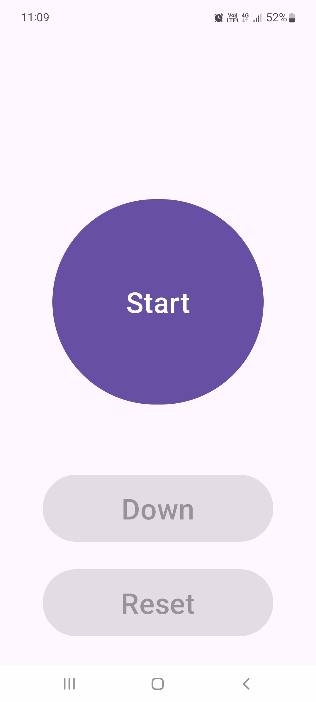
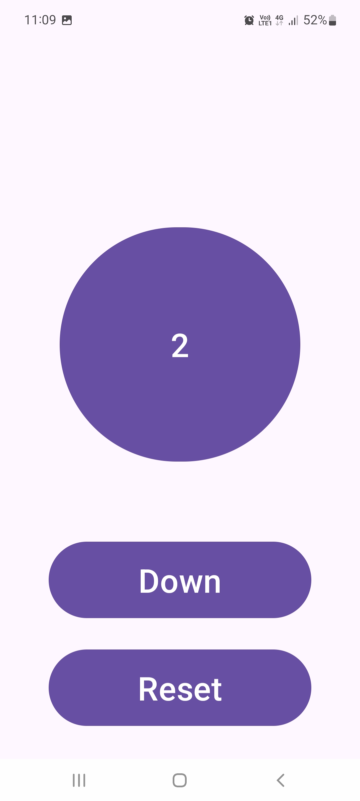
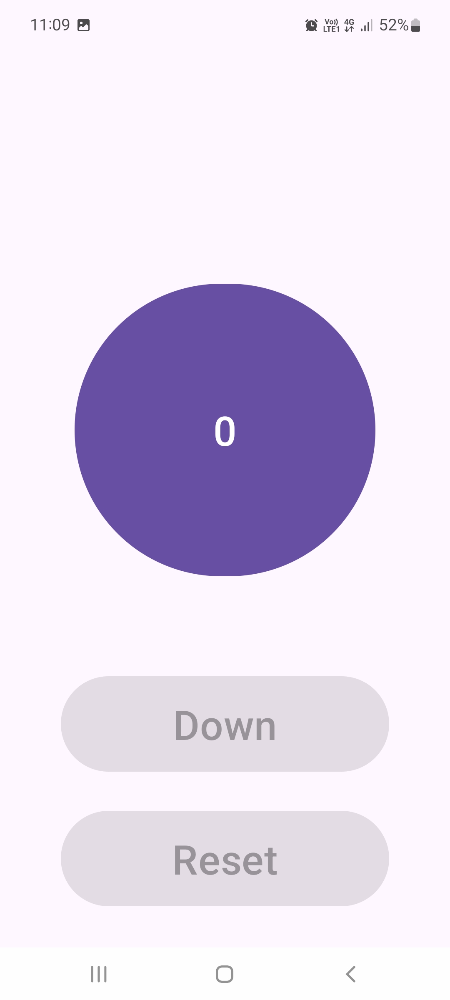

# Counter App

A simple Android counter app using **Kotlin** and **Fragments** to demonstrate UI updates, state persistence, and fragment-based architecture.

## Features
- Increment, decrement, and reset counter
- Saves counter value using **SharedPreferences**
- Uses **fragments** for better modularity

## Screenshots


| Screenshot 1 | Screenshot 2 | Screenshot 3 |
|-------------|-------------|-------------|
|  |  |  |


## Installation

Download *.apk* file from [Here](https://github.com/PandyaJayesh/Counter/tree/main/app/release).

## File Structure
```plaintext
app/
│── MainActivity.kt
│
│── res/layout/
│   ├── activity_main.xml

```

🎯 Contributors

[Jayesh Pandya](https://github.com/PandyaJayesh)

🚀 Feel free to fork, contribute, or suggest improvements! 🤝
